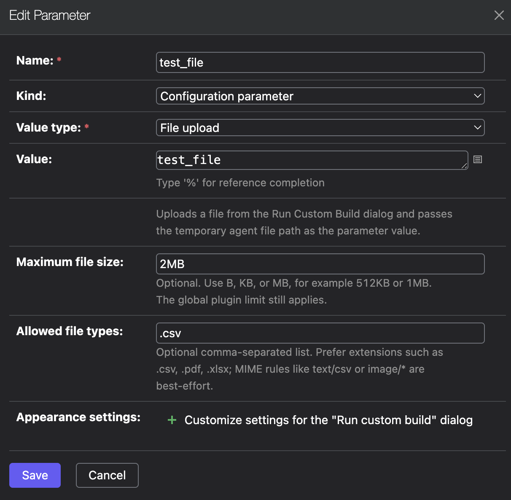
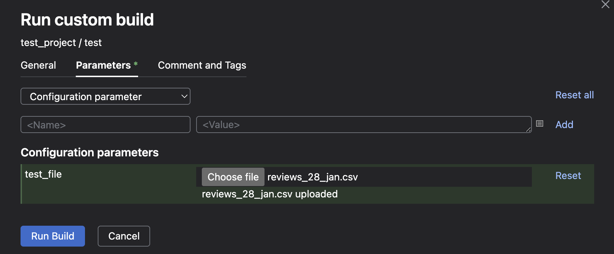

# TeamCity File Upload Parameter Plugin

Adds a TeamCity build parameter type named **File upload**. A user can upload a file from the Run Custom Build dialog, and the TeamCity agent receives the parameter value as a local temporary file path.

This is useful for small per-run input files such as CSV files, configuration snippets, manifests, test data, or other files that should not be committed to VCS.

## Features

- Adds a custom TeamCity parameter type: `file`
- Uploads files directly from the Run Custom Build dialog
- Replaces the parameter value with the downloaded agent-side file path
- Supports optional per-parameter file size limits
- Supports optional per-parameter allowed file types
- Enforces upload permissions and validates downloads against the running build context
- Persists upload metadata so queued builds can survive a TeamCity server restart until the configured TTL expires

## Screenshots

### Parameter Settings



### Run Custom Build Upload



## Compatibility

Minimum advertised TeamCity version: **TeamCity 2026.1**.

The plugin is compiled against TeamCity `2026.1` APIs and built with Java `21`. It has been runtime-tested against TeamCity `2026.1`.

Older TeamCity versions may work only if the plugin is rebuilt against their matching TeamCity OpenAPI artifacts and smoke-tested. Until that is done, `2026.1` should be treated as the supported minimum version.

## Build

Build with JDK 21 and Maven:

```bash
JAVA_HOME=/usr/local/opt/openjdk@21/libexec/openjdk.jdk/Contents/Home \
  mvn -Dmaven.repo.local=.m2/repository clean package
```

The plugin ZIP is created at:

```text
target/teamcity-file-upload-plugin.zip
```

## Install

1. Copy `target/teamcity-file-upload-plugin.zip` to the TeamCity Data Directory `plugins` folder.
2. Restart the TeamCity server.
3. Wait for TeamCity agents to update the bundled agent plugin.

Example:

```bash
cp target/teamcity-file-upload-plugin.zip /path/to/.BuildServer/plugins/
```

## Usage

1. Add a build parameter.
2. Set its value type to **File upload**.
3. Optionally configure:
   - **Maximum file size**, for example `512KB`, `1MB`, or `1048576B`
   - **Allowed file types**, for example `.csv,.pdf,.xlsx`
4. Run the build from **Run custom build**.
5. Choose a file for the parameter.
6. Start the build.

In build steps, use the parameter as a normal TeamCity parameter:

```bash
echo "Uploaded file path: %test_file%"
ls -l "%test_file%"
head -n 5 "%test_file%"
```

At runtime, `%test_file%` resolves to a path similar to:

```text
/opt/TeamCity/buildAgent/temp/buildTmp/file-parameters/input.csv
```

## File Type Rules

`Allowed file types` accepts a comma-separated list of extension or MIME rules:

```text
.csv,.json,.yaml
application/pdf
image/*
```

Prefer extension rules such as `.csv`, `.pdf`, or `.xlsx`. MIME type detection depends on the browser during client-side validation and on JDK/OS detection during server-side validation, so MIME-only rules are best-effort.

The server always validates uploaded files again after browser validation.

## Configuration

These TeamCity internal properties can tune plugin behavior:

```text
teamcity.fileParameter.maxUploadBytes=104857600
teamcity.fileParameter.serverTtlMinutes=120
teamcity.fileParameter.debug=false
```

`teamcity.fileParameter.maxUploadBytes` is the global upload limit in bytes. It always applies, even when a larger per-parameter limit is configured.

`teamcity.fileParameter.serverTtlMinutes` controls how long an uploaded file can wait on the server before it expires.

`teamcity.fileParameter.debug=true` enables detailed server and agent diagnostics. Leave it disabled during normal operation.

## Security Model

Upload requests require a logged-in TeamCity user with `RUN_BUILD` permission for the selected build configuration.

Download requests require:

- an authorized TeamCity agent or running-build access credentials
- the single-use upload marker secret
- a matching build type
- the exact upload marker in the running build parameters
- the same build owner when TeamCity exposes the running build owner

Uploaded file metadata is stored in the TeamCity plugin data directory. The marker secret is stored as a hash. The uploaded file itself remains readable to the TeamCity server process until it is downloaded, expires, or is cleaned up.

The File parameter value is not marked as a TeamCity secure parameter because the agent resolver must receive the full upload marker. Treat build parameters and queued build data as sensitive while a File upload build is queued or running.

### Uploaded File Safety

The plugin stores uploaded files outside the TeamCity web root and does not expose them as static web resources. Server-side files are saved under random token-based names, not under user-provided paths, and the original file name is sanitized before it is used on the agent.

The plugin does not execute uploaded files. It only passes the downloaded agent-side file path to the build. A file can be executed only if the build configuration explicitly does that, for example by running `bash "%file_param%"`, `source "%file_param%"`, or `chmod +x "%file_param%" && "%file_param%"`.

For production installations:

- grant `RUN_BUILD` only to users who are allowed to provide build input files
- configure per-parameter size limits and allowed file types whenever possible
- prefer extension rules such as `.csv`, `.json`, or `.yaml` for data-only workflows
- treat executable uploads such as `.sh`, `.ps1`, `.bat`, `.cmd`, `.exe`, or `.jar` as equivalent to allowing the user to run code on the build agent
- keep `teamcity.fileParameter.debug=false` during normal operation
- protect the TeamCity data directory and build agent temporary directories with normal OS file permissions

## Limitations

- The plugin is intended for regular TeamCity build configurations with an available `SBuildType`.
- Agentless, composite, detached, or other non-standard builds may be rejected.
- File uploads are single-use: after a successful agent download, the server removes the upload record and uploaded file.
- Browser-side file type validation is only a UX hint. Server-side validation is authoritative.
- Large files are not the main target. Use artifacts, dependencies, or external storage for large file workflows.

## Troubleshooting

Enable debug logs with:

```text
teamcity.fileParameter.debug=true
```

This logs upload, download, marker, owner, build type, parameter-map, and agent resolver diagnostics without logging the full marker secret.

For browser-side UI debugging, open DevTools and run one of:

```javascript
window.TeamCityFileParameterDebug = true
localStorage.TeamCityFileParameterDebug = "true"
```

Then reopen the Run Custom Build dialog.

## License

MIT License. See [LICENSE](LICENSE).
